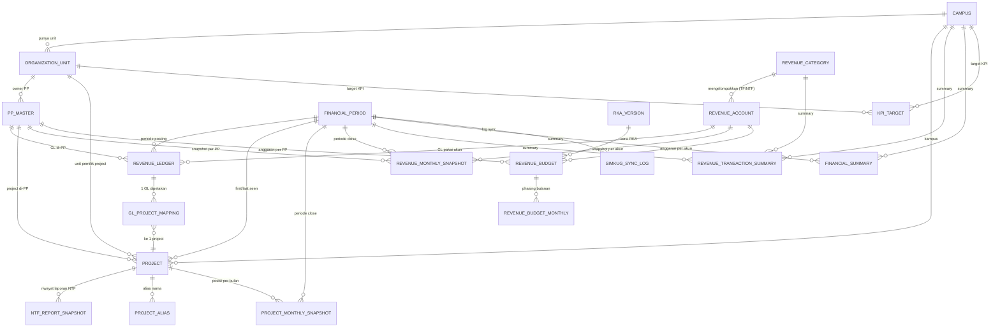
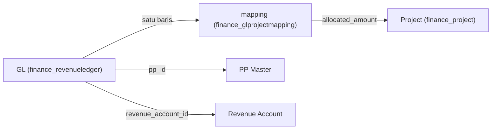
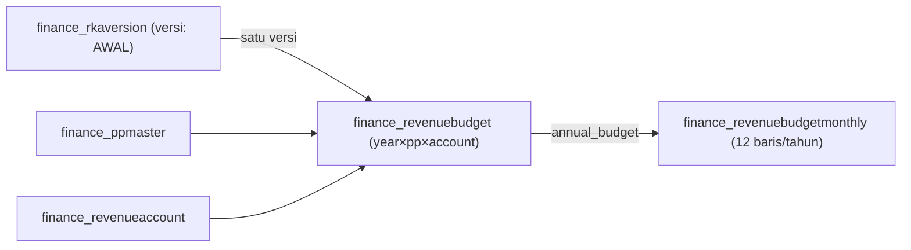
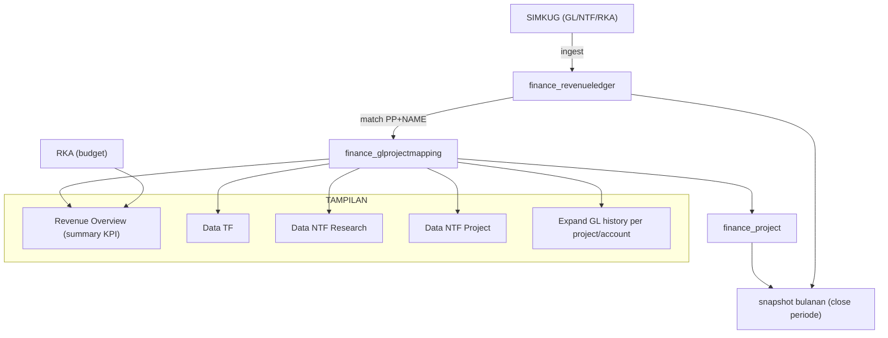

# RELASI ANTAR TABEL — Database Revenue (Django `finance`)

Dokumen read-only: menjelaskan seluruh tabel, foreign key, dan alur data
dari General Ledger (SIMKUG) sampai tampilan dashboard.

DB aktif: `db.sqlite3` (dev) / `financial_dashboard` (MySQL via `DB_ENGINE=mysql`).
Prefix tabel: `finance_` (aplikasi `finance`), sisanya framework Django.

---

## 1. PETA RELASI (ringkas)

---

## 2. Tabel MASTER (referensi)

| Tabel | PK | Kolom penting | Catatan |
|---|---|---|---|
| `finance_campus` | id | code **unique**, name, is_active | 4 kampus (hanya BDG terpakai) |
| `finance_organizationunit` | id | code **unique**, name, unit_type, campus_id → campus, parent_id → diri sendiri | struktur organisasi; `parent` utk hierarki |
| `finance_ppmaster` | id | pp_code **unique**, organization_unit_id → organizationunit, is_active | **PP ≠ Project**; 1 PP milik 1 OrgUnit |
| `finance_revenuecategory` | id | code **unique** (`TF`/`NTF_RESEARCH`/`NTF_PROJECT`), category_type | kategori pendapatan |
| `finance_revenueaccount` | id | account_code (index +is_active), account_name, subcategory, revenue_category_id → revenuecategory, detail_history_mode (`PERIOD_ONLY`/`HISTORICAL`), valid_from/valid_to, is_active | chart of account pendapatan |
| `finance_financialperiod` | id | year, month, period_start, period_end, is_closed | periode 2025-01 … 2026-08 |

**Alur hierarki:** `Campus 1—* OrganizationUnit 1—* PPMaster`, dan
`RevenueCategory 1—* RevenueAccount`.

---

## 3. Tabel TRANSAKSI & PROJECT (inti dashboard)

### `finance_revenueledger` — GL (sumber kebenaran revenue)
Satu baris = satu transaksi/line SIMKUG. Kolom RAW menyimpan nilai asli;
relasi ternormalisasi (`period_id`, `pp_id`, `revenue_account_id`) menunjuk ke
master — **NULL berarti UNMAPPED** (tetap dihitung, tidak dihapus).

| FK | ke | on_delete | Null? |
|---|---|---|---|
| period_id | finance_financialperiod | PROTECT | tidak |
| pp_id | finance_ppmaster | SET_NULL | boleh |
| revenue_account_id | finance_revenueaccount | SET_NULL | boleh |

Finansial: `debit`, `credit`, `source_balance` (DecimalField — bukan float).
Upsert key unik parsial: `(source_transaction_id, source_line_id)`.

### `finance_project` — Project Master (NTF Project / objek)
| FK | ke | on_delete | Null? |
|---|---|---|---|
| pp_id | finance_ppmaster | SET_NULL | boleh |
| organization_unit_id | finance_organizationunit | SET_NULL | boleh |
| campus_id | finance_campus | SET_NULL | boleh |
| first_seen_period_id | finance_financialperiod | SET_NULL | boleh |
| last_seen_period_id | finance_financialperiod | SET_NULL | boleh |

Kolom kunci: `project_number` (index; prefix `TF-`/`RS-`/`SRV-`/`P-`),
`contract_code`, `project_name`, **`project_value`** (nilai kontrak, Decimal 20,2),
`source_status`, `is_active`.

> **Project → PP**: satu project milik satu PP. PP berbeda TIDAK pernah digabung.
> Project **multi-account** tetap SATU baris di sini — pemecahan per account
> terjadi di level analisis (GL mapping), bukan duplikasi master.

### `finance_glprojectmapping` — jembatan GL → Project
| FK | ke | on_delete | Null? |
|---|---|---|---|
| ledger_id | finance_revenueledger | CASCADE | tidak |
| project_id | finance_project | SET_NULL | boleh |
| verified_by_id | auth_user | SET_NULL | boleh (kosong) |

Kolom lain: `allocated_amount`, `match_method`, `match_confidence`,
`match_status` (`AUTO_MATCHED`/`VERIFIED`/`NEEDS_REVIEW`/`UNMATCHED`).

**Ini relasi yang menentukan angka dashboard:**
`SUM(allocated_amount) WHERE project & pp & account & periode` = pendapatan.

---

## 4. Tabel SNAPSHOT / RIWAYAT (frozen historical)

| Tabel | Grain unik | FK | Isi |
|---|---|---|---|
| `finance_ntfreportsnapshot` | 1+ per (project, period) | project_id → project (CASCADE), period_id → financialperiod (PROTECT) | nilai laporan NTF mentah (`source_project_value`, …) utk rekonsiliasi |
| `finance_projectmonthlysnapshot` | **unique (project_id, period_id)** | project_id, period_id (CASCADE) | posisi per project saat close: opening/closing ytd & lifetime, recognized_month, project_value, remaining_value, status_at_close |
| `finance_revenuemonthlysnapshot` | **unique (period_id, pp_id, revenue_account_id)** | period_id, pp_id (CASCADE), revenue_account_id (CASCADE) | aktual per bulan grain periode×PP×akun |

Snapshot **tidak dihitung ulang** saat dibaca — nilainya dibekukan saat
penutupan periode (`is_frozen`, `frozen_at`).

---

## 5. Tabel SUMMARY (KPI / ringkasan tampilan)

| Tabel | FK | Isi |
|---|---|---|
| `finance_financialsummary` | period_id, campus_id (wajib); organization_unit_id (opsional); created_by/updated_by → auth_user (ops) | revenue/expense/SHU actual vs target per (periode×kampus×unit) |
| `finance_revenuetransactionsummary` | period_id, campus_id, organization_unit_id, revenue_category_id; created_by/updated_by → auth_user | actual vs target per (periode×kampus×unit×kategori) |
| `finance_kpitarget` | campus_id, organization_unit_id (opsional) | target KPI tahunan (`year`, `kpi_code`, `target_value`) |

Alur: `FinancialPeriod` → `RevenueTransactionSummary` (via `RevenueCategory`),
dan `Campus/OrgUnit` ikut menentukan grain.

---

## 6. RKA (anggaran)

| Tabel | FK | Grain |
|---|---|---|
| `finance_rkaversion` | — (year, version_code) | versi RKA (ACTIVE) |
| `finance_revenuebudget` | rka_version_id → rkaversion, pp_id → ppmaster, revenue_account_id → revenueaccount | **year × PP × account**, `annual_budget` |
| `finance_revenuebudgetmonthly` | revenue_budget_id → revenuebudget (CASCADE) | **12 baris per budget** (month 1..12), `budget_amount`; unik `(revenue_budget, month)` |

Validasi: `annual_budget = SUM(budget_amount Jan–Des)`.

---

## 7. AUDIT / MATCHING / LOG

| Tabel | FK | Isi |
|---|---|---|
| `finance_projectalias` | project_id → project (CASCADE), pp_id → ppmaster (SET_NULL) | alias nama yang dipelajari dari deskripsi GL utk matching berikutnya |
| `finance_financialdataauditlog` | user_id → auth_user (ops) | jejak aksi (mis. CLOSE periode) |
| `finance_simkugsynclog` | period_id → financialperiod (SET_NULL) | satu baris per proses sync SIMKUG (GL/NTF/RKA) |

---

## 8. Tabel framework Django

`auth_user`, `auth_group`, `auth_permission` (+ tabel pivot),
`django_content_type`, `django_migrations`, `django_session`,
`django_admin_log` — dipakai Django; data dummy **tidak** mengisinya
(auth_user 0 baris; semua FK ke user di tabel finance NULL).

---

## 9. ALUR DATA END-TO-END (dashboard)

### Rumus penting (dipakai service `finance/services/`)

- **Pendapatan Diakui** = SUM `allocated_amount` GL
  `WHERE project + PP + account + year + month` (bulan dipilih).
- **Total Pendapatan** = SUM `allocated_amount`
  `WHERE project + PP + account AND posting_date <= period_end` (lifetime).
- **Nilai Proyek** = `finance_project.project_value` (Project Master) — bukan GL.
- **Progress** = Total Pendapatan (semua account project) / Nilai Proyek.
- **Status** = NO_REVENUE / ON_PROGRESS / FULLY_RECOGNIZED / NEEDS_REVIEW.

---

## 10. INVENTARIS FK LENGKAP

| Tabel anak | Kolom FK | Tabel induk | on_delete |
|---|---|---|---|
| finance_organizationunit | campus_id | finance_campus | CASCADE |
| finance_organizationunit | parent_id | finance_organizationunit | CASCADE |
| finance_ppmaster | organization_unit_id | finance_organizationunit | SET_NULL |
| finance_revenueaccount | revenue_category_id | finance_revenuecategory | PROTECT |
| finance_revenueledger | period_id | finance_financialperiod | PROTECT |
| finance_revenueledger | pp_id | finance_ppmaster | SET_NULL |
| finance_revenueledger | revenue_account_id | finance_revenueaccount | SET_NULL |
| finance_project | pp_id | finance_ppmaster | SET_NULL |
| finance_project | organization_unit_id | finance_organizationunit | SET_NULL |
| finance_project | campus_id | finance_campus | SET_NULL |
| finance_project | first_seen_period_id | finance_financialperiod | SET_NULL |
| finance_project | last_seen_period_id | finance_financialperiod | SET_NULL |
| finance_glprojectmapping | ledger_id | finance_revenueledger | CASCADE |
| finance_glprojectmapping | project_id | finance_project | SET_NULL |
| finance_glprojectmapping | verified_by_id | auth_user | SET_NULL |
| finance_ntfreportsnapshot | project_id | finance_project | CASCADE |
| finance_ntfreportsnapshot | period_id | finance_financialperiod | PROTECT |
| finance_projectmonthlysnapshot | project_id | finance_project | CASCADE |
| finance_projectmonthlysnapshot | period_id | finance_financialperiod | CASCADE |
| finance_revenuemonthlysnapshot | period_id | finance_financialperiod | CASCADE |
| finance_revenuemonthlysnapshot | pp_id | finance_ppmaster | CASCADE |
| finance_revenuemonthlysnapshot | revenue_account_id | finance_revenueaccount | CASCADE |
| finance_financialsummary | period_id | finance_financialperiod | CASCADE |
| finance_financialsummary | campus_id | finance_campus | CASCADE |
| finance_financialsummary | organization_unit_id | finance_organizationunit | CASCADE |
| finance_financialsummary | created_by_id / updated_by_id | auth_user | SET_NULL |
| finance_revenuetransactionsummary | period_id | finance_financialperiod | CASCADE |
| finance_revenuetransactionsummary | campus_id | finance_campus | CASCADE |
| finance_revenuetransactionsummary | organization_unit_id | finance_organizationunit | CASCADE |
| finance_revenuetransactionsummary | revenue_category_id | finance_revenuecategory | CASCADE |
| finance_revenuetransactionsummary | created_by_id / updated_by_id | auth_user | SET_NULL |
| finance_revenuebudget | rka_version_id | finance_rkaversion | CASCADE |
| finance_revenuebudget | pp_id | finance_ppmaster | CASCADE |
| finance_revenuebudget | revenue_account_id | finance_revenueaccount | CASCADE |
| finance_revenuebudgetmonthly | revenue_budget_id | finance_revenuebudget | CASCADE |
| finance_projectalias | project_id | finance_project | CASCADE |
| finance_projectalias | pp_id | finance_ppmaster | SET_NULL |
| finance_kpitarget | campus_id | finance_campus | CASCADE |
| finance_kpitarget | organization_unit_id | finance_organizationunit | CASCADE |
| finance_financialdataauditlog | user_id | auth_user | SET_NULL |
| finance_simkugsynclog | period_id | finance_financialperiod | SET_NULL |

---

## 11. ANGKA SEED (dummy, sesuai import)

| Tabel | Jumlah |
|---|---|
| finance_campus | 4 |
| finance_organizationunit | 15 |
| finance_ppmaster | 49 |
| finance_revenuecategory | 3 (TF, NTF_RESEARCH, NTF_PROJECT) |
| finance_revenueaccount | 26 |
| finance_financialperiod | 16 (2025-01 … 2026-08) |
| finance_rkaversion | 2 |
| finance_revenuebudget | 229 |
| finance_revenuebudgetmonthly | 2748 |
| finance_project | 272 (TF- 32, RS- 178, SRV- 36, P- 26) |
| finance_projectalias | 637 |
| finance_revenueledger | 660 |
| finance_glprojectmapping | 660 |
| finance_ntfreportsnapshot | 26 |
| finance_revenuemonthlysnapshot | 455 |
| finance_projectmonthlysnapshot | 564 |
| finance_financialsummary | 64 |
| finance_revenuetransactionsummary | 192 |
| finance_kpitarget | 4 |
| finance_simkugsynclog | 0 |
| finance_financialdataauditlog | 319 |
